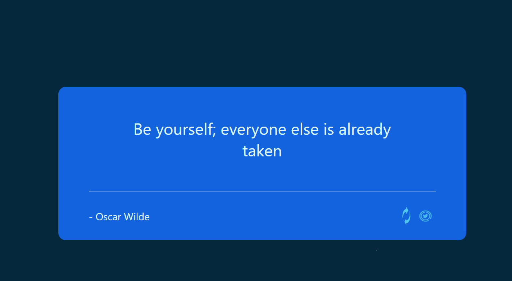

# Random Quote Generator 

A simple web application that generates random quotes fetched from an external API. Clicking on the reload icon fetches a new random quote to display.

## How it Works

This project utilizes React to create a web application that fetches random quotes from the [Type Fit Quotes API](https://type.fit/api/quotes). Upon loading the page, a default quote is displayed. Clicking the reload icon triggers a function to fetch and display a new random quote from the API.

## Preview

## Installation

To run this project locally:

1. Clone the repository: `git clone`
2. Navigate to the project directory: `cd random-quote-generator`
3. Install dependencies: `npm install`
4. Start the application: `npm start`

## Usage

Once the application is running, open it in your web browser. Click the reload icon to fetch and display a new random quote. Enjoy the inspiration!

## Technologies Used

## Contributing

Contributions are welcome! Feel free to fork the repository, make changes, and create a pull request. Please follow the contributing guidelines.

## License

This project is licensed under the [MIT License](LICENSE).
